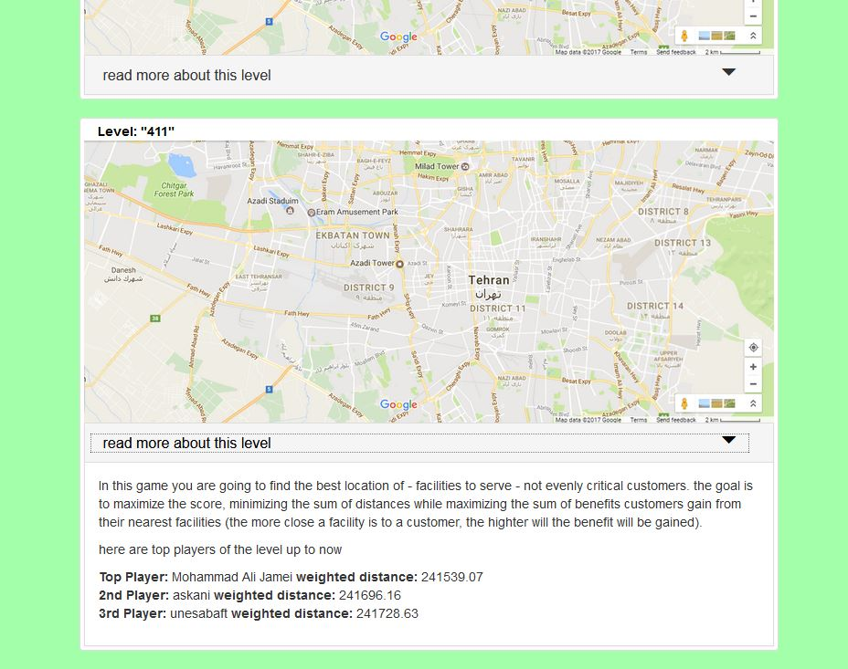
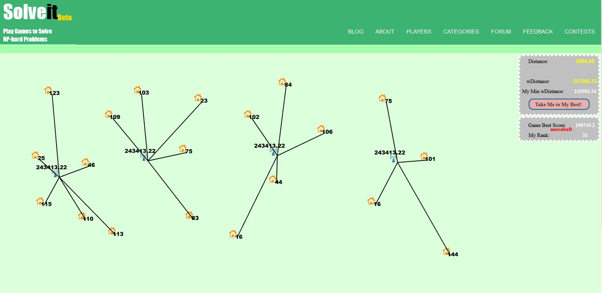

# SolveIt
SolveIt is an online crowdsourcing game, which employs wisdom of the crowd to solve NP-Hard problem of location allocation.

The game was played in rounds and the results got published in Springer journal of Computing 2019:
https://link.springer.com/article/10.1007/s00607-018-0670-1
DOI: 10.1007/s00607-018-0670-1

A demo version of the game can be accessed on : http://webtech.uoz.ac.ir/projects/solveit/
Use user and password as: test
